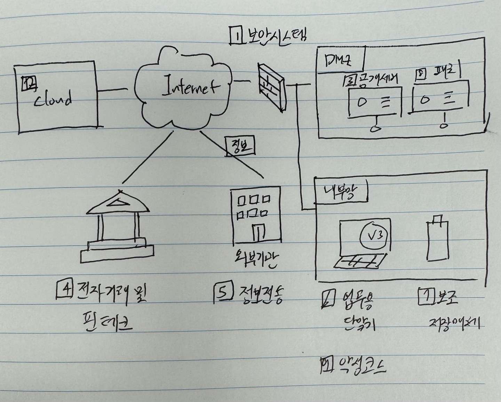

## 목차

## 2.10.1 보안시스템 운영

## 2.10.2 클라우드 보안

## 2.10.3 공개서버 보안

## 2.10.4 전자거래 및 핀테크 보안

## 2.10.5 정보전송 보안

## 2.10.6 업무용 단말기기 보안

<pre>
업무용 단말기 보안 통제 정책   
P2P 이용 금지 but 불가피하게 공유시 보안 정책  
분실시 비밀번호 대책   
주기적 점검
</pre>

## 2.10.7 보조저장매체 관리

## 2.10.8 패치관리

## 2.10.9 악성코드 통제