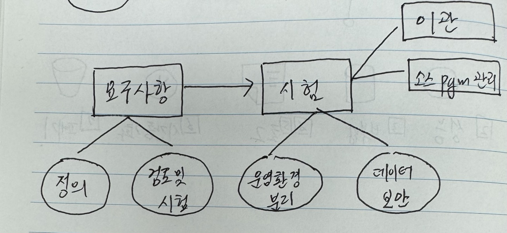
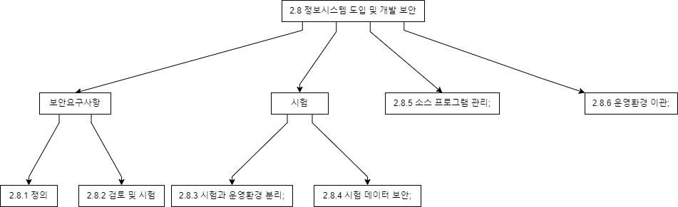

## 목차

## 2.8.1 보안 요구사항 정의

- 시큐어코딩 표준

## 2.8.2 보안 요구사항 검토 및 시험

- 개인정보 영향평가
    - 의무 대상 : 공공기관 (5민고100개 + 50연계)
    - 평가 수행 : 영향평가기관 (개인정보 보호위원회 지정)
    - 결과 제출 : 2개월 내 개인정보 보호위원회
    - 이행 점검 : 1년 내 개인정보 보호위원회 제출

## 2.8.3 시험과 운영 환경 분리

## 2.8.4 시험 데이터 보안

## 2.8.5 소스 프로그램 관리

## 2.8.6 운영환경 이관