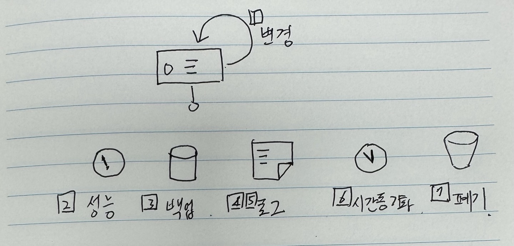
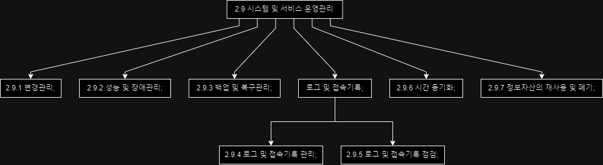

## 목차

## 2.9.1 변경관리

## 2.9.2 성능 및 장애관리

## 2.9.3 백업 및 복구관리

## 2.9.4 로그 및 접속기록 관리

## 2.9.5 로그 및 접속기록 점검

- 목적 : 개인정보취급자의 이상접속, 이상행위 파악
- 방법 : 정보시스템에 대한 로그 및 접속기록 **점검**
- 비교 : 2.9.5 로그 및 접속기록 점검 vs 2.11.3 이상행위 분석 및 모니터링 
    - **2.11.3 이상행위 분석 및 모니터링**은 침해사고에 대한 분석 및 모니터링
    - 2.9.5 로그 및 접속기록 점검은 개인정보취급자의 이상행위 파악

## 2.9.6 시간 동기화

## 2.9.7 정보자산의 재사용 및 폐기